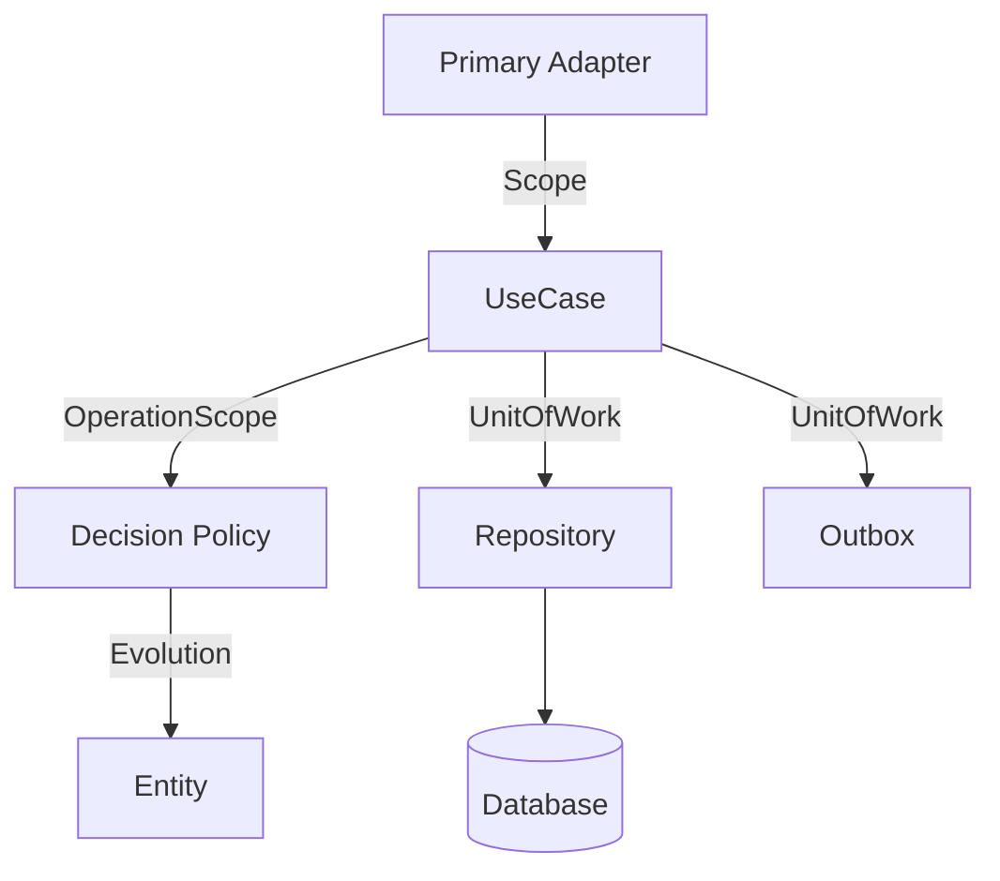

# Software Architecture Document (SAD): Ṛta Framework

## 1. Architectural Goals
- **Separation of Concerns:** Strict Hexagonal (Ports & Adapters) architecture.
- **Governed Execution:** All operations must run within an `OperationScope`.
- **Capability-Based Security:** Unforgeable tokens of authority for all privileged actions.
- **AI-Native:** Designed to be mechanically enforced, making it easy for LLMs to follow.

## 2. The Strict Architecture Suite

The framework is built around the "Strict" pattern suite, which leverages `OperationScope` for execution:

- **StrictPrimaryAdapter:** Entry points that create the authorized scope.
- **StrictUseCase:** Application orchestration with Zod validation and managed tracing.
- **StrictPolicy:** Pure, deterministic business logic.
- **StrictEntity:** Immutable state that only evolves via authorized tokens.
- **StrictRepository:** Transactional data access coupled to the `UnitOfWork`.

## 3. Layers & Components

### 3.1 The Core (Inside)
- **Domain:** Entities, Value Objects, Policies. Pure logic, zero I/O.
- **Application:** UseCases, Process Managers, Projectors. Orchestration.
- **Ports:** Interfaces for interacting with the outside world.

### 3.2 The Adapters (Outside)
- **Primary Adapters:** HTTP, CLI, Event Listeners.
- **Secondary Adapters:** External APIs, Message Queues.
- **Persistence:** Repositories and Unit of Work.

## 4. Key Primitives

### 4.1 OperationScope
A centralized container for `InternalCtx` and `UnitOfWork`. It is the single source of authority for an operation.

### 4.2 Capability-Based Security
Uses unforgeable tokens (`CommitCap`, `PolicyToken`) stored in a `CapabilityBag` within the context.

## 5. Logical View

## 6. Implementation Constraints
- No global variables for context.
- No direct database access from UseCases (must use Repository via UoW).
- No I/O, time, or randomness in the Domain layer.

For more details, see the [Table of Contents](TableOfContents.md).
