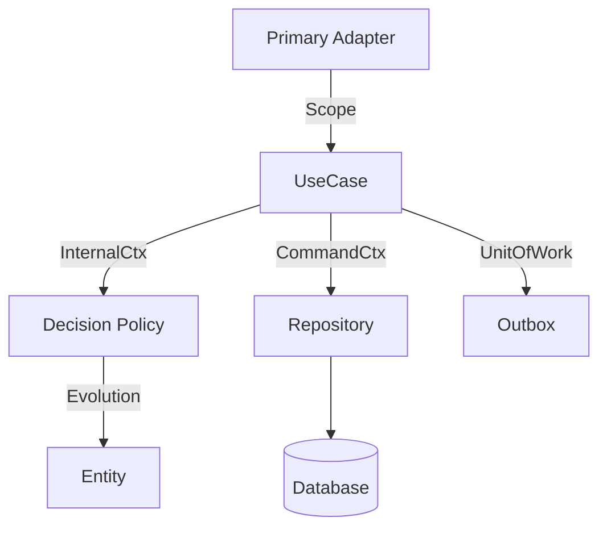

# Software Architecture Document (SAD): Ṛta Framework

## 1. Architectural Goals
- **Separation of Concerns:** Hexagonal (Ports & Adapters) architecture.
- **Strict Integrity:** Capabilities-based security and type-level execution locks.
- **Observability-First:** First-class support for distributed tracing and structured logging.
- **AI-Native:** Designed to be easily understood and correctly implemented by LLMs.

## 2. Layers & Components

### 2.1 The Core (Inside)
- **Domain:** Entities, Value Objects, Policies. Pure logic, zero I/O.
- **Application:** UseCases, Process Managers, Projectors. Orchestration.
- **Ports:** Interfaces for interacting with the outside world.

### 2.2 The Adapters (Outside)
- **Primary Adapters:** HTTP, CLI, Event Listeners. Entry points.
- **Secondary Adapters:** External APIs, Message Queues.
- **Persistence:** Repositories and Unit of Work.

## 3. Key Architectural Patterns

### 3.1 OperationScope
A centralized container for `InternalCtx` and `UnitOfWork`. It serves as the single source of authority for an operation.

### 3.2 Capability-Based Security
Instead of role-based access control (RBAC), we use unforgeable tokens (`CommitCap`, `PolicyToken`) stored in a `CapabilityBag` within the context.

### 3.3 The "Strict" Suite
Base classes (`StrictUseCase`, `StrictEntity`, etc.) that enforce Zod validation, tracing, and capability checks by default.

### 3.4 Outbox Pattern
Ensures that domain events are never lost and are only published after a successful database commit.

## 4. Logical View

## 5. Deployment View
The framework is designed to run in distributed Node.js environments, supporting horizontal scaling through its event-driven, outbox-based communication.

## 6. Implementation Constraints
- No global variables for context.
- No direct database access from UseCases (must use Repository).
- No I/O in the Domain layer.
